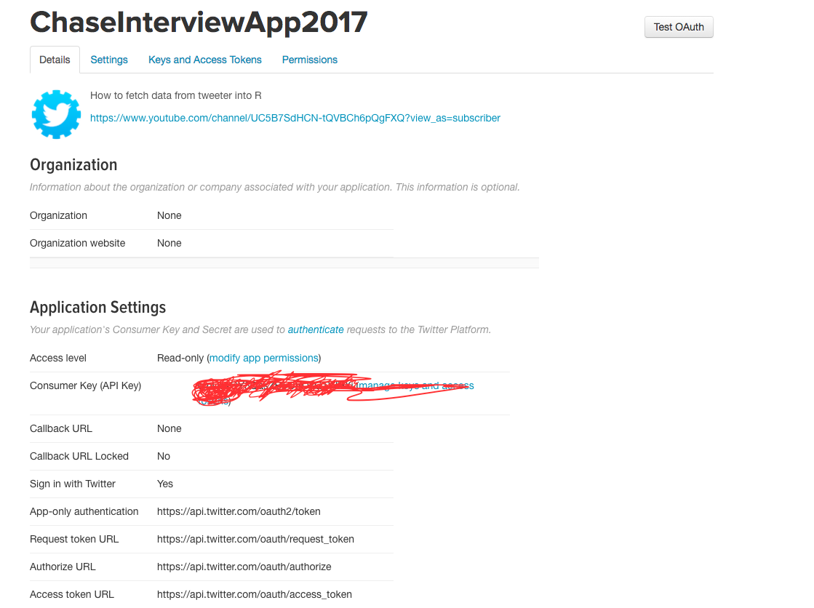

# Twitter-Analysis
A quick analysis on the polarity of tweets to @Chase account on the Twitter!

# Instructions

Before you can access the twitter api you need to register your client application with Twitter. There are many twitteR authentication tutorial that explains step by step how to set up your app for oauth authentication.

Once you have registered with Twitter go to My Applications page on Twitter and you should see your newly created application. Click on the link and you should see the application details page:

Now you can run the code as it is.

Thanks!
